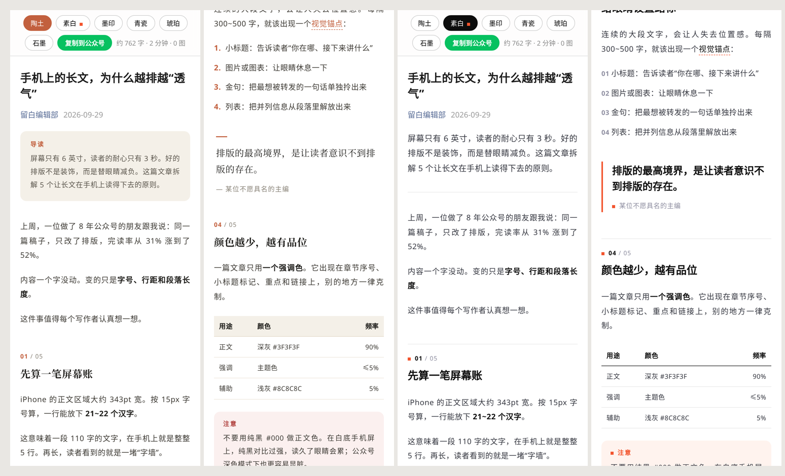
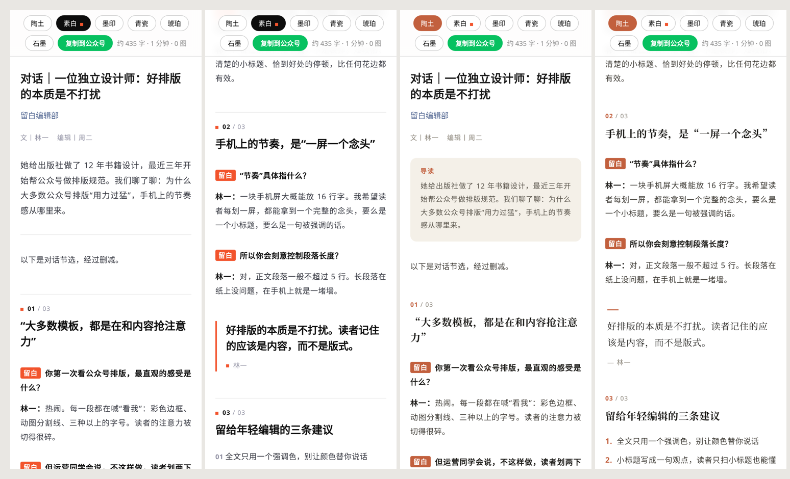
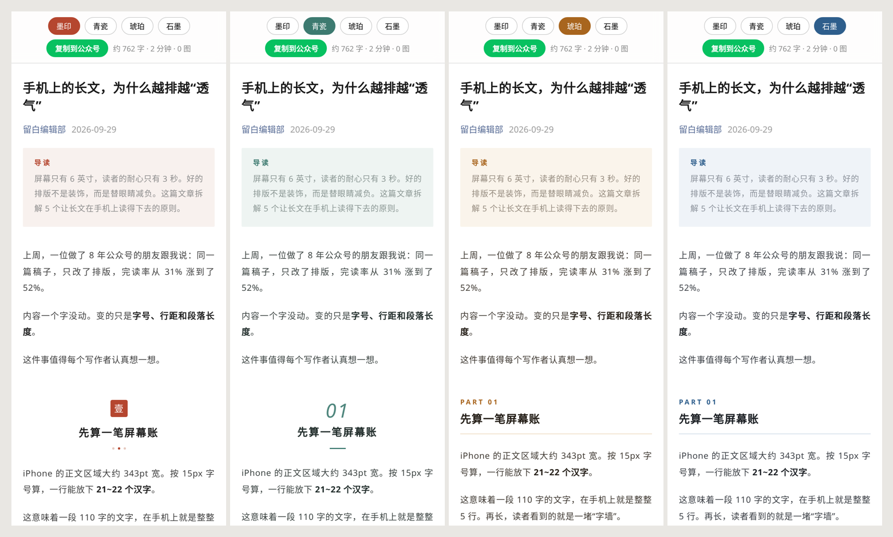

# wechat-article · 微信公众号写作与排版 Skill

一个面向 AI 编码助手（Claude Code / Kiro 等支持 `SKILL.md` 的 Agent）的 skill，负责**想**、**写**、**排**三件事：

- **想**：以晚点、财新、三联、远川、《经济学人》为参照。动笔前先写论点卡，核心判断必须可以被反驳；用拆数字、换参照系、二阶效应等 7 种方法找独到角度；证据必须具名，不编造。交稿前按 6 项评分表自评，不达标就继续改。
- **写**：按手机阅读习惯写稿。标题 ≤26 字，段落多数 60–110 字、最长 150 字，视觉锚点首选配图，少用装饰标签。改稿四遍（结构、段落、句子、去 AI 味），终稿比初稿短 20%–30%。
- **人味**：作者在场、细节有信息量、写动作不写情绪、句子长短跟着意思走、结尾不升华。不虚构经历和细节。最后专门留一遍去 AI 味，`--check` 会标出书面腔、拔高腔、设问自答、排比三连、高频“不是……而是……”、句子长短过于均匀等 20 多类问题。
- **排**：一条命令把 Markdown 转成全内联样式的 HTML，能直接粘贴进公众号编辑器。主推两套主题，分别借鉴 Claude 和 OpenAI 的设计风格，另有四套备选主题。

## 主推主题



| | 陶土 `clay`（默认） | 素白 `mono` |
|---|---|---|
| 借鉴 | Claude 的暖调编辑风格 | OpenAI 的极简黑白风格 |
| 我们的改动 | 陶土橙比 Claude 的珊瑚橙更深；标题用中文宋体；默认白底，只在色块上用燕麦色 | 黑白灰之外加一点信号橙；章节之间用细线分隔；金句用大号无衬线字体 |
| 共同的标志 | 章节只写「01」序号，不加 PART、总数等标签 | 同左 |

## 参考头部公众号

实测了晚点、少数派、APPSO、远川研究所、刘润、极客公园等 12 个账号的 29 篇文章（见 `references/benchmarks.md`），据此加入了：

- 署名行 `byline`
- 访谈问答 `:::qa`
- 大序号章节 `h2: big`
- 金句着色 `bold: accent`
- 16px 大字号 `size: 16`
- 观点句式小标题的写法指南
- 标题栏目前缀的检查规则



## 全部六套主题



## 目录

```
wechat-article-skill/
├── SKILL.md                    # Agent 入口：工作流程与硬性规则
├── EVOLUTION.md                # 演进记录：每次修改的问题、证据、结果、取舍
├── scripts/md2wechat.py        # Markdown → 公众号 HTML（零依赖）
├── references/
│   ├── content-craft.md        # 内容功夫：选题 / 立论 / 独到观点 / 证据与核查 / 精炼 / 自评
│   ├── human-voice.md          # 人味：细节、节奏、克制、AI 味清单、改写示例
│   ├── writing-guide.md        # 移动端写作指南：标题 / 开头 / 段落 / 结尾 / 合规
│   ├── layout-system.md        # 排版系统：字体间距、主题、开关、语法、组件、兼容性
│   └── benchmarks.md           # 头部公众号实测：正文 / 小标题 / 标题的规律
├── templates/                  # 新闻 / 观点 / 清单 / 故事 / 教程 / 访谈 六种骨架
├── examples/                   # demo（排版原则）与 interview（访谈体）示例及预览
└── assets/                     # 截图
```

## 安装

把 `wechat-article-skill/` 复制到 Agent 的 skills 目录，例如：

```bash
cp -r wechat-article-skill ~/.claude/skills/wechat-article     # Claude Code
cp -r wechat-article-skill .kiro/skills/wechat-article         # Kiro（工作区级）
```

之后对 Agent 说“帮我写一篇公众号文章，主题是……”即可触发。

## 单独使用排版脚本

```bash
python scripts/md2wechat.py article.md             # → article.html：手机预览 + 六主题切换 + 一键复制
python scripts/md2wechat.py article.md -t mono     # 指定主题
python scripts/md2wechat.py article.md --check     # 只做检查：排版 + 文风 + 人味（套话 / AI 腔 / 模糊信源 / 句子节奏）
python scripts/md2wechat.py article.md --check --no-style   # 只查排版
python scripts/md2wechat.py article.md --fragment  # 只输出可粘贴的 HTML 片段
python scripts/md2wechat.py --list-themes
```

在浏览器里打开生成的 `.html`，点「复制到公众号」，再粘贴到公众号后台编辑器。

注意：`.md` 是源稿，样式只存在于生成的 `.html` 里。直接复制 Markdown 会丢掉全部样式。文件在 GitHub 上时，用 `https://htmlpreview.github.io/?<.html 文件的 GitHub 地址>` 在浏览器里打开，再点复制。例如[示例文章预览](https://htmlpreview.github.io/?https://github.com/zhao6300/files/blob/wechat-article-skill/wechat-article-skill/examples/rsi.html)。

## 设计要点

- **移动端优先**：正文 15px、行高 1.85、字距 0.5px、两端对齐，每行约 21 个汉字。
- **全文一个强调色**：主题色只用在序号、标记、重点、链接上。
- **章节样式各有辨识度**：陶土和素白用细小的「01」序号，墨印用朱砂印章汉字序号，青瓷用斜体衬线数字，琥珀和石墨用杂志式小序号 + 底线。
- **符合公众号限制**：全部内联样式；外链自动转成脚注；背景用低饱和浅色，兼容深色模式；中文用弯引号；中英文之间自动加空格。
