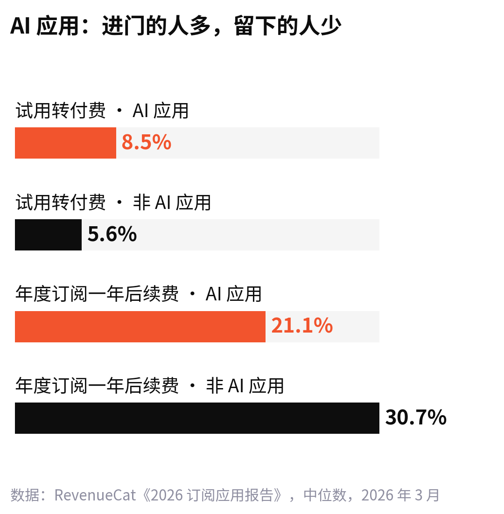
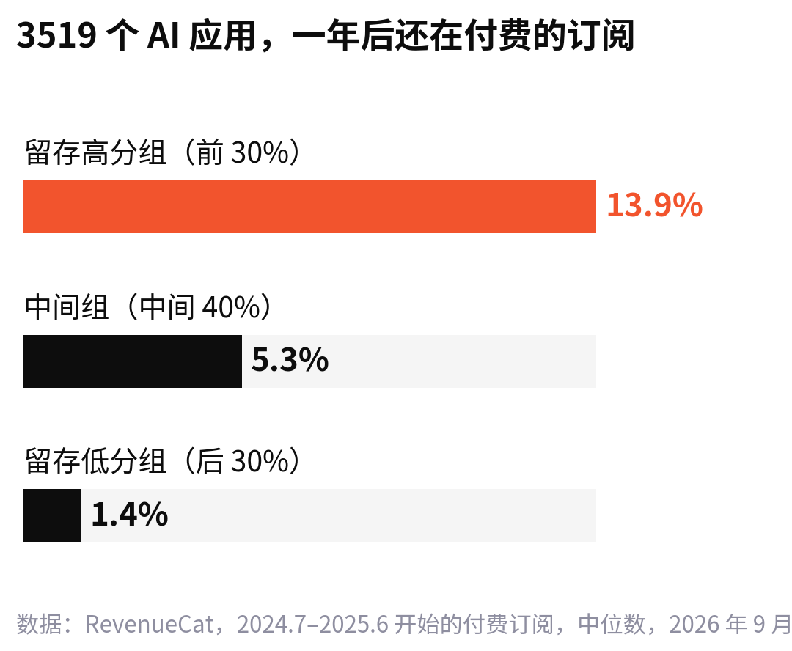
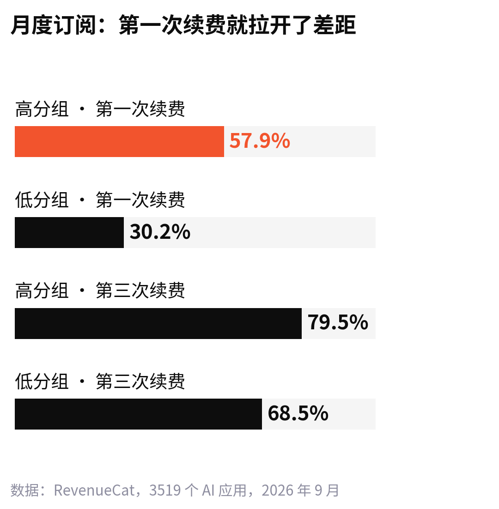

<!--
论点卡
核心判断：AI 产品能不能被反复使用，取决于每次使用有没有在产品里留下东西（作品、上下文、配置），而不是第一次的效果有多惊艳。
为什么反直觉：多数团队把力气花在首次体验的“哇”和转化上，觉得模型越强、效果越惊艳，用户就越会回来。
最强证据：RevenueCat 9 月对 3519 个 AI 应用的研究：一年后付费留存，高分组 13.9%、低分组 1.4%；差距主要出在第一次续费（57.9% 对 30.2%）；低分组的共同点是“一次性惊艳”。
最强反方：用户越来越多地同时用几家 AI（a16z：约 20% 的 ChatGPT 网页周活同时用 Gemini），聊天记录锁不住人；留存好的巨头靠的是模型持续变强。
回应：锁住人的不是记录，是“离开就会丢的东西”；模型变强是巨头的杠杆，小团队能控制的是积累。
读者收获：一个检查自己产品的问题——用户明天删掉它，会丢掉什么。
-->

<!-- 【待补：可选。作者自己装过又删掉的一个 AI 应用，删之前打开过几次、最后一次用它做了什么。放在第一段之前，一两句即可。】 -->

把一张自拍变成职业证件照，或者拍一下客厅，一键换成北欧风。订阅数据公司 RevenueCat 在 9 月的一份研究[《3500 多个 AI 应用的留存研究》](https://www.revenuecat.com/blog/growth/ai-app-retention-study)里，拿这两件事举例：用户付了钱，拿到一张满意的图，发给朋友看，然后再也没有打开过这个应用。

RevenueCat 管这叫“一次性”问题。它 3 月发布的年度订阅应用报告里有一组数字（据 [TechCrunch](https://techcrunch.com/2026/03/10/ai-powered-apps-struggle-with-long-term-retention-new-report-shows/) 报道）：AI 应用把试用用户转成付费用户的比例是 8.5%，非 AI 应用是 5.6%；可到了一年后，年度订阅还在续费的，AI 应用只剩 21.1%，非 AI 应用是 30.7%。

进门的人多了一半，留下的人少了三分之一。

我的判断是：**AI 产品能不能被反复使用，看的不是第一次多惊艳，而是每用一次，有没有在产品里留下点东西。**

## AI 应用最会拉人进门，也最留不住人

RevenueCat 服务着 7.5 万多个应用开发者，报告里约 27% 的订阅应用自称“AI 驱动”。这些应用第一年从每个付费用户身上赚的钱，比非 AI 应用高 41%。钱来得快，走得也快：月度订阅的留存是 6.1% 对 9.5%，退款率是 4.2% 对 3.5%。

投资机构 a16z 给这批人起过一个名字，叫“AI 游客”：注册，付一两个月的钱，然后离开。它的说法是，大多数潜在用户都愿意花 20 美元试一个月。a16z 去年 9 月在[《Retention Is All You Need》](https://a16z.com/ai-retention-benchmarks/)里甚至建议，AI 公司算留存不要从第 0 个月算，从第 3 个月算，因为头三个月的曲线里，混着太多只是来看看的人。

从第 3 个月算，等于承认：AI 产品头三个月的数字，已经不太能说明用户会不会回来。

## 同是 AI 应用，一年后差了 10 倍

“AI 应用留存差”是个平均数。RevenueCat 9 月把 3519 个 AI 应用按一年后的付费留存排了序，分成高、中、低三组，平均数底下的差别就露出来了。

高分组一年后还留着 13.9% 的付费订阅，低分组只有 1.4%。都是 AI 应用，差的不是“有没有 AI”。

差距在哪一步拉开的？主要在第一次续费。月度订阅里，高分组有 57.9% 的人续了第二个月，低分组只有 30.2%。到第三次续费时，两组只差 11 个百分点（79.5% 对 68.5%）。

也就是说，用户在付完第一个月的钱之后、第二次扣款之前，就已经做了决定。这 30 天里，他有没有第二个理由打开你，基本决定了这个产品能不能被复用。

低分组的画像很清楚：2024 年以后才上线、不给试用、主推周订阅、价格偏高，集中在照片视频、娱乐类。工具和教育类更多落在高分组。研究者自己也提醒，这些只是相关，不能证明因果。但把这几条放在一起看，很像一套“趁热度赶紧收钱”的打法。

一位应用增长顾问 David Vargas 在研究里说得更直白：很多 AI 应用上线后几乎没人长期用，因为用户是看了某个爆款视频、冲着某一个功能来的。

## 留得住的产品，每次都留下点东西

把镜头拉到大产品上，同样的规律更明显。

a16z 去年 12 月的[《2025 消费级 AI 年度盘点》](https://a16z.com/state-of-consumer-ai-2025-product-hits-misses-and-whats-next/)引用 YipitData 的数据：ChatGPT 的日活是月活的 36%，Gemini 是 21%；桌面端用户 12 个月后的留存，ChatGPT 是 50%，Gemini 是 25%。同一份盘点里，Sora 的独立应用下载超过 1200 万次，可 30 天后还在用的不到 8%，头部消费应用一般在 30% 以上。

a16z 说 Sora 作为创作工具很成功，问题不在视频的质量。差别在于，你在 ChatGPT 里问过的问题、存下的记忆、上传的文件、连上的邮箱和日历，会让下一次回答更贴合你；在 Sora 里生成完一条视频，下一次打开，一切从零开始。

a16z 在今年 3 月的[第六版 AI 应用百强榜](https://a16z.com/100-gen-ai-apps-6/)里把这件事写成一句话：上下文会复利，模型越了解你，结果越好，你就越常用它。

同一份榜单里还有两个对照：

- Midjourney 在 2023 年第一版榜单里排进前 10，现在掉到第 46 位。ChatGPT 和 Gemini 自带的出图模型追上来之后，“生成一张好图”这件事被顺手打包了。
- Notion 的付费用户里，买 AI 功能的比例一年内从 20% 涨到 50% 以上，AI 已经贡献了公司大约一半的年收入。它的 AI 不一定比别人强，可用户的文档、会议记录和项目本来就放在这里，AI 每次都在这些积累上干活。

一次性生成的能力，最容易被更大的模型吃掉；长在用户积累之上的能力，才会被一次次用起来。

:::quote
用户第二次回来，是因为第一次留下了东西。
:::

RevenueCat 给开发者的建议，也落在这里。它列了三种让人回来的理由：结果会随着模型越来越了解用户而变好；作品会越攒越多，比如项目、历史记录、素材库；再加上小组件、提醒这类外部触发。前两条是积累，第三条只是提醒。积累不够，推送再多，也只是在提醒用户取消订阅。

## 记忆锁得住人吗

最有力的反对意见是：AI 产品之间换起来越来越容易，记忆和聊天记录根本锁不住人。

数据支持这个担心。a16z 去年底统计，2025 年大部分时间里，ChatGPT 的周活用户中不到 10% 会去用另一家大模型；到今年 3 月的百强榜，这个说法变成了约 20% 的 ChatGPT 网页周活同时在用 Gemini。据 YipitData，截至今年 1 月，Claude 的付费用户同比涨了 200% 以上，Gemini 涨了 258%。用户在货比三家，而且比得越来越勤。

还有一点要承认：ChatGPT 的留存曲线好看，很大一部分是因为模型本身在变强。据 OfficeChai 转述，a16z 今年 2 月发布过一张 YipitData 的图表：ChatGPT 用户 24 个月后的留存还在往上走，约 70%。这是模型公司才有的杠杆，大多数接模型的小团队用不上。

但换得勤，不等于能搬走。a16z 在百强榜里也写了：一旦用户把自己的 AI 连上了日历、邮件和客户管理系统，再换就难得多。聊天记录可以不要，配好的工作流、攒了一年的文档库、跑了几个月的自动化，丢了是要重新搭的。

所以我不觉得“记忆”本身是护城河。护城河是用户离开时要付的代价。一个产品如果删掉之后，用户什么都不会丢，那它再惊艳，也只是一次演示。

---

RevenueCat 在研究最后说，下一步要去访谈那些留存最好的 AI 应用团队，看它们具体做了什么。这份访谈出来之后，值得对照着看一遍。

在那之前，做 AI 产品的人可以先问自己一个问题：如果用户明天删掉你的应用，他会丢掉什么？

你手机里最近删掉的那个 AI 应用，是在第几次打开之后删的？
