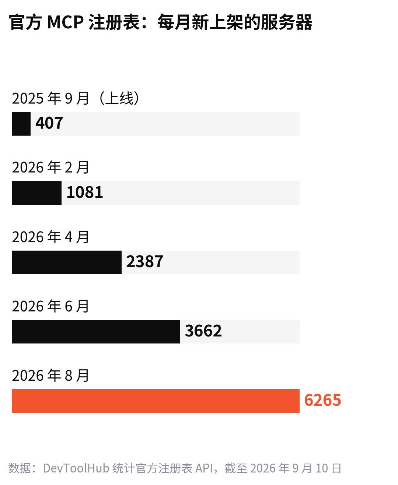
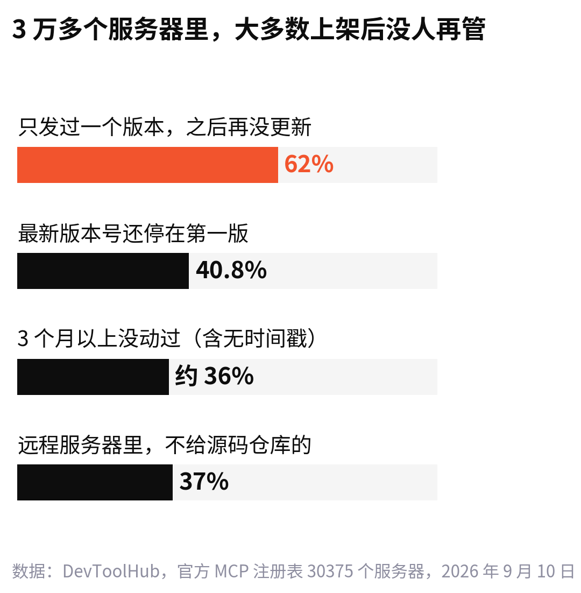
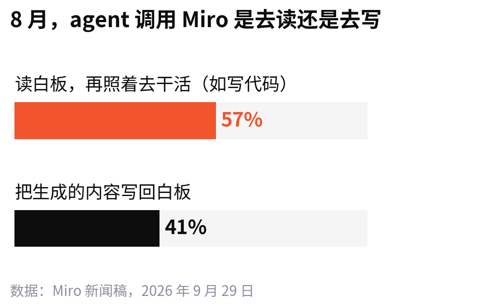

<!--
论点卡
核心判断：AI 时代的“复用”，主角从人变成了 agent；能被 agent 反复调用的产品，拆得小、写得清、靠得住，而且握着工作的状态。
为什么反直觉：产品圈说“复用”，大多还在谈用户留存、组件库；把能力开放给 agent，常被当成“接个 API”的技术活。
最强证据：Miro MCP 1600 万次调用、57% 是读白板；官方 MCP 注册表 3 万个服务器里 62% 上架后没更新；SkillsBench：聚焦的 2–3 个模块胜过大而全的文档，模型自己写的 skill 没用。
最强反方：被 agent 调用，用户就看不到你的界面，产品会沦为管道。
读者收获：一套检查自己产品能不能被 agent 复用的办法；知道哪些“可复用”只是上架了。
-->

9 月 29 日，也就是今天，Miro 发了一份[新闻稿](https://finance.yahoo.com/technology/ai/articles/momentum-grows-miro-mcp-users-130000643.html)。它的 MCP 服务器从 2 月上线到现在，被调用了 1600 多万次，5 月以来翻了一倍多；9 月一个月，预计会到 600 万次。

发起这些调用的，不是打开 Miro 网页的人，而是 AI 工具。8 月，Claude Desktop 和 Claude Code 贡献了约 65% 的调用；ChatGPT 排第二，8 月到 9 月用户涨了 71%。一共有 15 种 AI 客户端接进来过。

更意外的是用的人。工程师和开发者不到四分之一，产品、设计、市场、运营和项目管理加起来，人数大约是工程师的两倍。

MCP 是一套让 AI 调用其他软件的通用接口，过去被当成程序员的玩具。现在，一个产品经理在 Claude 里说一句“把这块白板上的需求整理成开发任务”，Miro 就被用了一次，而他可能根本没打开 Miro。

以前我们说“复用”，指的是用户每天回来打开你。现在，越来越多的“回来”发生在别人的对话框里。

## 复用你的，越来越多是 agent

这几个月，大公司在同一件事上站到了一起。据 [ToolDirectory](https://tooldirectory.ai/blog/state-of-mcp-servers-2026) 整理：

- 7 月 9 日，OpenAI 把 ChatGPT 里的“连接器”改名为“插件”。
- 7 月，微软 Copilot Studio 支持把 MCP 服务器当工具用，并开始做认证。
- 7 月 29 日，Gemini Enterprise 上线 MCP 连接器预览版；8 月 6 日，加上了自动发现工具。

7 月 28 日定稿的新版 MCP 规范，是它发布以来改动最大的一次。核心改成了“无状态”：每次请求自己带齐信息，不用先握手、不用维持会话；“这个服务器有哪些工具”的列表，可以缓存起来反复用。GitHub 和 Vercel 的服务器在一周内就改了过来。

这些改动都指向一件事：让同一个能力，被成千上万个 agent 一次次地、便宜地调用。

另一层是 skill：一个文件夹，写着某件事该怎么做，再附上脚本和资料。Anthropic 去年 12 月把格式公开成标准，到今年 6 月，官方展示页上列出了约 40 个支持它的产品，包括 OpenAI Codex、GitHub Copilot、Cursor。同一份 skill 写一次，能在这些工具里直接用。

接口负责“能做什么”，skill 负责“该怎么做”。两样都在变成能到处复用的零件。

## 上架了，不等于有人用

零件多得很快。开发者媒体 [DevToolHub](https://devtoolhub.com/mcp-registry-by-the-numbers/) 把官方 MCP 注册表的数据全部拉下来数了一遍：截至 9 月 10 日，一共 30375 个服务器，是 5 月的 3 倍左右。

8 月一个月新上架的，比注册表头五个月加起来还多。可再往下看，情况就不一样了：

数量本身也有水分。最大的单个发布者一个人上架了 1505 个服务器，几乎每 20 个里就有一个是他的，干的是“英亩换算公顷”这类只有一个功能的小事。排名前 50 的发布者，占了全部服务器的四分之一。

最有意思的是另一头：注册表是 Anthropic、GitHub、微软牵头建的，可 Anthropic 名下一个都没有，GitHub 只有 1 个。人们真正常用的那些服务器，大多不在这张清单上，还是靠文档和口口相传被找到。

skill 那边也一样。一个几十人的研究团队做了评测 [SkillsBench](https://arxiv.org/abs/2602.12670)，拿 86 个任务、7308 次运行来测 skill 到底有没有用：经过人工整理的 skill，平均把通过率提高了 16.2 个百分点；可在 84 个任务里，有 16 个用了 skill 反而更差。

能被找到、被信任、被反复调用的，只是其中很小一部分。

## 被反复调用的能力，有三个共同点

把这几个月的数据放在一起看，被复用的能力大致有三个共同点。

**第一，拆得小。** SkillsBench 发现，聚焦的、只包含两三个模块的 skill，效果好过一份把所有东西都写进去的“完整文档”。Miro 被调用的也不是整个 Miro，而是两件具体的事：读一块白板，往白板上写东西。

**第二，写得清。** skill 标准有个设计：agent 一开始只读每个 skill 的名字和一段描述，觉得对得上，才去加载完整内容。MCP 工具也是这样，模型靠名称和描述决定调不调用。这段描述就是你在货架上的标签，写得含糊，模型就选不中你。

**第三，靠得住。** 被 agent 调用，意味着它会替用户把数据交给你。今年 2 月，据 [The Hacker News](https://thehackernews.com/2026/02/researchers-find-341-malicious-clawhub.html) 报道，安全公司 Koi Security 检查了 OpenClaw 技能市场上的 2857 个 skill，发现 341 个是恶意的。8 月 10 日又出现了一种更狡猾的（据 ToolDirectory 整理）：一个恶意 MCP 服务器在 74 分钟里被塞进 23 个 GitHub 合并请求，它的工具描述前两次调用看起来都正常，第三次才变坏，一次性审查根本查不出来。

在这样的环境里，“有人持续维护、每个版本都说得清改了什么”本身就是竞争力。那 62% 上架后从没更新过的服务器，输的多半不是功能。

还有一个发现，我觉得对做产品的人最有用。同样是人工整理的 skill，在软件工程任务上只提高了 4.5 个百分点，在医疗任务上提高了 51.9 个百分点。而让模型自己写 skill，平均没有任何帮助。

:::quote
模型最缺、也最写不出来的，是某个行业里的人才知道的做法。这恰好是最值得打包成可复用能力的东西。
:::

通用的小工具，谁都能做，很快就不值钱；一家做医疗账单的公司把核对流程写成 skill，别人很难替它写。

## 被调用，会不会沦为管道

反对的声音很直接：agent 替用户调用你，用户就看不见你的界面、记不住你的品牌，你只是别人对话框背后的一根管子。

这个担心不是空穴来风。Notion 已经在说明文档里写明，本地版 MCP 服务器以后可能停掉，统一走远程。越来越多的产品，会在用户看不见的地方被使用。

Miro 的数据给了另一种可能：

这些 agent 调用 Miro，大半是去读：读白板上的想法、需求和图，再照着去写代码、做计划。它们也会把结果写回来，让团队在同一块白板上接着改。Miro 在新闻稿里给自己的定位，是 AI 时代的“协作和上下文层”。

管道和平台的区别，也许就在这里：别人的 agent 做完活，结果会不会落回你这里。如果团队的工作状态存在你那儿，agent 每次都得来找你；如果你只是做一次换算、查一个数，那就很容易被换掉。

需要说明的是，这是 Miro 自己公布的数字，600 万是预测值，也没有说这些调用带来了多少付费。它能证明的是“被调用得越来越多”，还证明不了“被调用就能赚钱”。

---

如果要检查自己的产品，可以先问四个问题：

1. 它最常被人用来做的那两三件事，能不能单独拿出来，让 agent 直接调用？
2. 只看名称和一句描述，一个模型能不能判断什么时候该用它？
3. 有没有人持续维护它，改了什么说得清楚吗？
4. agent 用完之后，结果会不会落回你这里？

Miro 这次在新闻稿里报的是调用次数，而不是日活。一家协作软件开始用这种方式统计自己被用了多少次。
