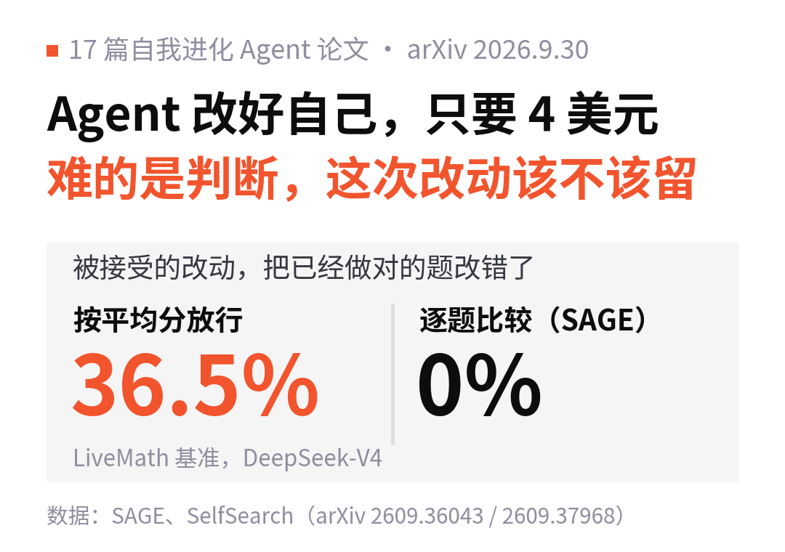
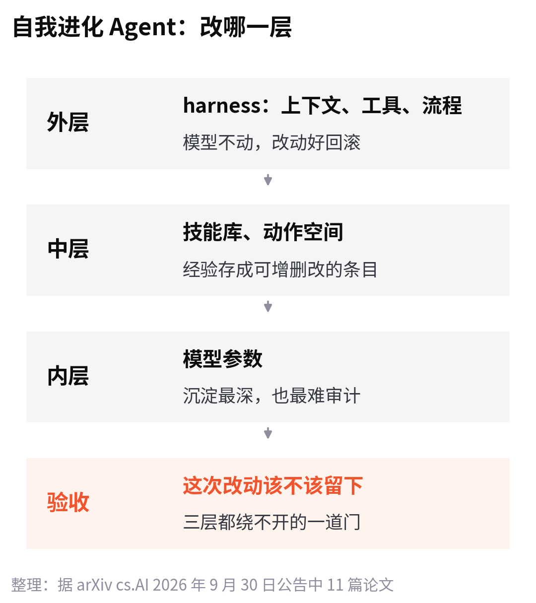
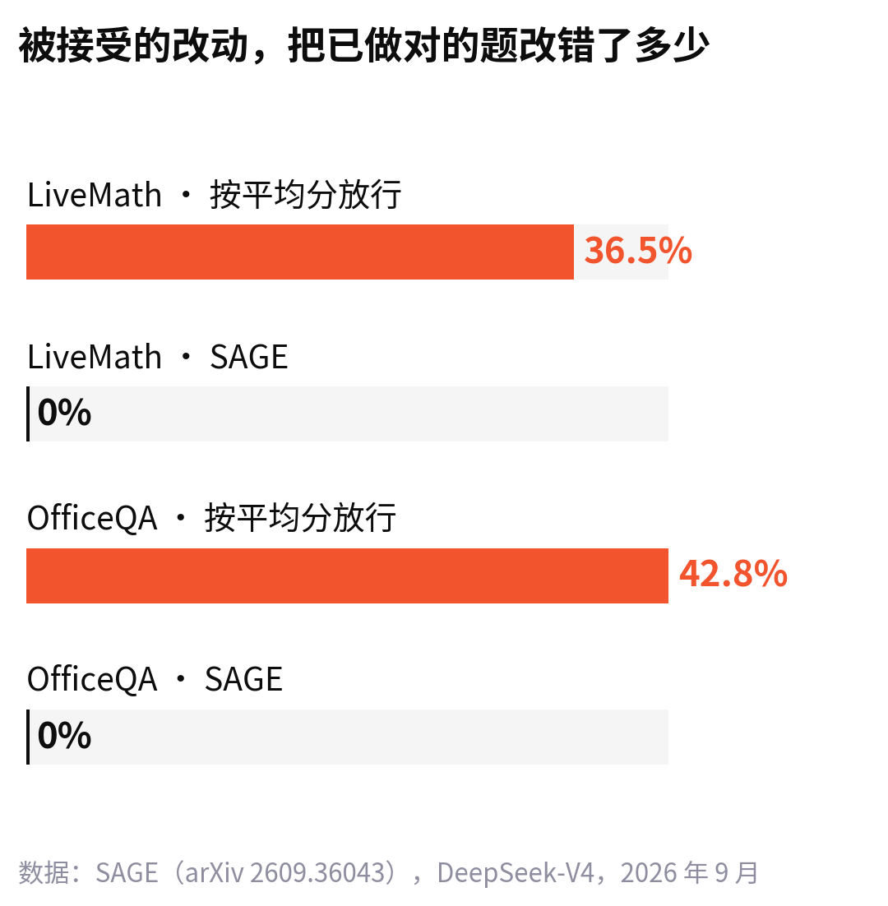

<!--
论点卡
核心判断：自我进化 Agent 的瓶颈正在从“怎么提出改动”转到“怎么验收改动”；按平均分放行，是这套循环里最容易出事的一环。
为什么反直觉：多数工作和讨论集中在优化器，也就是让 Agent 提出更好的修改；验收被当成“跑一遍验证集看分数”的小事。
最强证据：SAGE（2609.36043）：按验证集平均分放行时，LiveMath 上被接受的改动会把已经做对的题改错 36.5%；换成逐题配对比较 + 单侧检验后降到 0%，20 组设置里最终分都是最高。
最强反方：验收门越严，接受的改动越少，进化越慢。回应：同等预算下，SAGE 只接受基线改动的一部分，最终分反而更高；真正的代价是验证集要够大、要能逐题比较。
读者收获：做 Agent 产品的团队，允许 Agent 改自己之前，先把“逐题回归检查”搭起来。
改动说明：原文“搜索成本 4.03 美元”对应的是 82.0% 那个结果，不是 11.2 个百分点；SAGE 的对象是技能文档；B-OPSD 的 27.50→41.30 限定在 rollout-privileged 设置。均已按摘要改正。
-->

4.03 美元能买到什么？在 SelfSearch 这篇论文里，能买到一个新的 Agent。

这篇[《SelfSearch》](https://arxiv.org/abs/2609.37968)让 Agent 翻看自己以前改自己的记录，接着再改，全程不用下游任务的打分。它只花了 4.03 美元做搜索，找到的 harness 配上 DeepSeek V4 Flash，在 Terminal-Bench 2.1 上做对 82.0% 的任务，追平了一份公开对比里得分最高的 Codex。

同一天，另一篇论文[《SAGE》](https://arxiv.org/abs/2609.36043)算了另一笔账：按验证集平均分决定要不要接受一次自我修改，用 DeepSeek-V4 在 LiveMath 上跑，被接受的改动会把 Agent 本来已经做对的题改错 36.5%。

9 月 30 日，arXiv cs.AI 当天的公告里，有 17 篇论文在做自我进化 Agent。我们读了其中 11 篇，最大的感受是：**让 Agent 改自己已经很便宜了，贵的是判断哪次改动该留下。**

## 它们在改三样东西

自我进化 Agent，指的是 Agent 在使用中根据自己的经验改进自己，不靠人来调。17 篇论文的分歧不在要不要改，而在改哪一层。

最外层是 harness，也就是包在模型外面的上下文、工具和执行流程，模型不动；中间是一份能增删改的技能库；最里层是模型参数。越往里，效果越能沉淀下来，也越难回滚和审计。

## 改外层：几美元换一个 harness

改 harness 的三篇，差别在“下一次改什么”由谁决定。

[《Mixture of Self-Improving Branches》](https://arxiv.org/abs/2609.37834)觉得单条搜索路线容易困在局部最优，就把搜索拆成几个分支，每个分支有自己的开发集和提议策略，最后用一个路由器给每道题挑一个分支的 harness。在奥赛级数学推理上，它比 Meta-Harness 相对提升 34.8%；到了 SWE-bench Lite，提升只剩 3.8%。

SelfSearch 走的是另一头：不看分数，只看经验。开头那个 4.03 美元的结果之外，它在 6 组模型和基准的组合里，都让群体平均成功率高过初始 Agent，单个 Agent 最多涨了 11.2 个百分点。

[《Video-RSI》](https://arxiv.org/abs/2609.37950)用在视频理解上。执行记录只包含当前 harness 看到的画面，失败原因往往说不清，于是 Agent 回头重看训练视频，用新的观察去验证几种不同的失败解释，再决定怎么改。改完的 Agent 看的帧更少，准确率更高。

## 攒技能：库越小越好用

第二组把经验存成技能或动作，存得越精，越好用。

[《EASE》](https://arxiv.org/abs/2609.36746)先发现了一个问题：学出来的技能管理器，和哪个执行模型一起训练，就只在那个模型上表现最好。它的办法是给管理器一份执行模型最近的“行为画像”，让它据此增删改技能。结果技能库小了 34.5%–41.0%，技能检索效果提升 36.3%–38.7%，部署时的推理 token 省了 9%–15%。换成训练时没见过的 Kimi K2.6、Gemini 3.5 Flash，也不用单独微调。

[《AnyAct》](https://arxiv.org/abs/2609.37025)管的是动作。工具多到塞不进上下文、质量还会因为更新或宕机忽好忽坏，它就把各种工具统一成一个动作空间，用的过程中把不可靠的动作剪掉。在作者自己做的 OSMCP 基准上，它用 50 步做到 77.27% 的成功率，大多数对手要用两倍的步数。

## 训进参数：一句心得就够

第三组还是在训练模型，只是训练信号来自模型自己。这一组里，结果最出人意料的是 RLTL;DR。

[《RLTL;DR》](https://arxiv.org/abs/2609.37633)挑的是 128 次尝试都做不对的难题。在这些题上，用常规 GRPO 训练 Qwen 3.5 9B，一次就做对的概率始终只有 0% 到 1%。RLTL;DR 让模型每失败一次，就看着验证器的输出写一句 TL;DR 心得，下一次带着所有心得再试，并把“这类任务 → 这句心得”训练进参数。评测时不给任何心得，模型也能做对 12%–13%。

作者还做了个更省的版本：只拿 4000 组“任务, 心得”配对做监督训练，不看任何完整轨迹，效果几乎追平完整的 RLTL;DR。用他们的话说，要学的只是“遇到这类任务，记得留意这件事”。

另外两篇解决的是训练信号本身的质量。[《GMAE》](https://arxiv.org/abs/2609.36750)在没有人工标注的自我奖励强化学习里，把一条回答放进不同的分组语境里多次算奖励，取平均，让优势估计更稳。[《B-OPSD》](https://arxiv.org/abs/2609.37132)先让模型往前多训练一段，拿这个“未来的自己”当老师，再退回原来的状态让老师来带。在 Qwen3-4B 的数学推理上，一个设置里从 27.50 分涨到 41.30 分。

## 按平均分放行，会把会做的题改错

三组论文都在想办法让 Agent 提出更好的改动。SAGE 问的是下一步：改动提出来之后，凭什么接受它？

它研究的循环很常见：Agent 维护一份技能文档，写着工作流程、工具规则和决策逻辑；优化器提出一处修改，一道“门”决定收不收。现在的门几乎都用同一条规则：验证集平均分涨了，就收。

这条规则有两个漏洞。第一，平均分涨了，可能是新做对的题比改错的题多，那些原本做对、现在做错的题就被放了进来。第二，验证集有限、分数有噪声，在一堆候选里挑出“分数最高”的那个，它的分数天然偏高，统计上叫“优化器诅咒”。

SAGE 的改法是：新旧两版技能文档在同一批题上逐题对比，改错一道题的惩罚重于改对一道；再做一次单侧检验，只有赢面在统计上站得住才接受，否则宁可不改。

论文里的“回退率”，指的是被接受的改动把原本做对的题改错的比例。在 5 个基准、4 个模型组成的 20 组设置里，SAGE 有 19 组降低了回退率，另一组持平；20 组的最终分全部最高，LiveMath 从 34.15 分涨到 48.78 分。

:::quote
允许 Agent 改自己之前，先得有办法发现它改坏了什么。
:::

另外两篇从别的方向碰到了同一个问题。

[《SafeCoEvo》](https://arxiv.org/abs/2609.36580)把安全放进进化：短期把最近的运行经验写成可更新的安全规则，长期把它训进一个判断风险的守卫模型，比最强的基线不安全结果少了 10.05%，任务成功率还高了 12.15%。

[《Harness Evolution as Learning》](https://arxiv.org/abs/2609.36892)干脆把 harness 进化当成一个学习问题，从理论上分析它的上限：交互证据有限时，harness 能学到多少，更新又会往哪边偏。

## 门太严，会不会拖慢进化

最自然的反对意见是：验收越严，接受的改动越少，Agent 进化得越慢。

SAGE 的数据给了一个回应。同样的预算下，它只接受了基线门接受的一部分改动，最终分反而在 20 组设置里都最高。被挡掉的，是收益在统计上站不住、或者靠改错旧题换来的改动。

但它也有代价。逐题对比需要一个足够大、能反复跑的验证集，而 SafeCoEvo 提醒了真实部署的样子：新任务一个个来，反馈要等任务做完才有，没有一个固定的题库可以反复考。在这种场景里，SAGE 的门该怎么搭，论文没有回答。

还要说明一点：这是一天的数据。17 篇集中出现，说明这个方向今天很热闹，还不能说明它在上升。

---

我们的看法是，对已经在做 Agent 产品的团队，这批论文里最该先抄的不是哪个优化器，而是 SAGE 那道门：每次允许 Agent 改自己的提示词、技能或工具，都在一批固定的题上逐题比一遍新旧版本，改错的单独列出来。

没有这一步，Agent 的“进化”很可能只是在两三个版本之间来回换。

你的 Agent 现在改一次提示词，上线前会重跑哪些用例？

:::card 本文涉及的论文
均来自 arXiv cs.AI 2026 年 9 月 30 日的公告，该方向当天共 17 篇，本文选读 11 篇。论文内容以原文摘要为准，“我们的看法”为编辑观点。
:::
